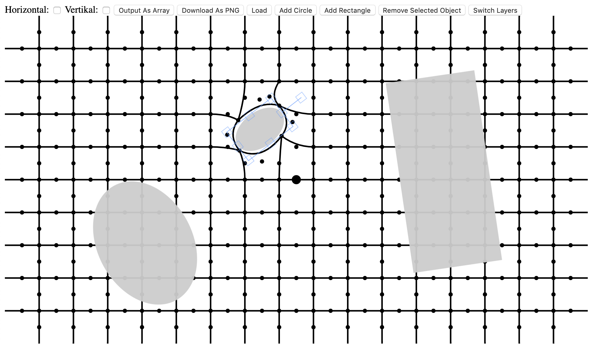

# Interaktives Amsler-Gitter


## Struktur/Aufbau:
Das Amsler-Gitter besteht aus horizontalen und vertikalen Linien, die an ihren Überkreuzungen mit einander verbunden sind.
Jede horizontale und vertikale Linie besteht aus vielen in Reihe verbundene [Bézierkurven](https://de.m.wikipedia.org/wiki/Bézierkurve). 
Jede dieser (quadratischen) Bézierkurve besteht aus einem Start- und einem Endpunkt, sowie einem Mittelpunkt. Mit Hilfe dieser Punkte lässt sich die Krümmung der Kurve verändern. 
An einer Kreuzung befindet sich ein Knoten, mit dem die Position der Kreuzung verändert werden kann. Ein weiterer Knoten befindet sich auf dem Mittelpunkt jeder Bézierkurve, womit sich diese noch feiner justieren lassen. 

**Sonstige Hinweise stehen im Quellcode!**



## Besonderheit:
* Größe der Canvases kann beliebig sein    
```html 
    <canvas id="grid" width="720" height="450"></canvas>
    <canvas id="from" width="960" height="540" ></canvas>
```
* Anzahl der horizontalen und vertikalen Linien kann beliebig sein
```javascript
    let amountOfVerticalLines = 16;
    let amountOfHorizontalLines = 9;
```
* Anpassung vom Aussehen über globale Variablen
```javascript 
    /** Breite der Linien */
    let linewidth = 3.5;
    /** Groesse der Knoten-Farbe */
    let noderadius = 5;
    /** Groesse der Knoten (fuer Touch/Mouse-Controlls) */
    let nodepadding = 5;
    /** Knoten-Farbe */
    let nodecolor = "black"; // oder '#000'
```

* Man kann Rechtecke und Kreise auf das Amsler-Gitter aufbringen und ihre Größe und Form anpassen 
(dazu über den Button "Switch Layers" in die andere Ebene wechseln und loslegen. Um wieder das Grid anzupassen, Button nochmal drücken)

* Ausgewächlte Flächen können auch wieder entfernt werden

* Horizontale und vertikale Linien können über die zwei Tick-Boxen separat unsichtbar gemacht werden 


## Schnittstellen:
* ```returnAmslerGrid()``` Gibt ein Array mit allen Veränderten Knoten zurück. <br>***(POST zum Server muss implementiert werden!)***
```javascript
    let array = returnAmslerGrid();
    array[0];       //Liste aller vertikalen Nodes die bewegt wurden
    array[1];       //Liste aller horizontalen Nodes die bewegt wurden
    array[2];       //Liste aller kreuzungs-Knoten/nodes die bewegt wurden     
    array[3][0];    // Canvas-Grid-Breite
    array[3][1];    // Canvas-Grid-Hoehe
    array[3][2];    // Anzahl der verticalen Linien
    array[3][3];    // Anzahl der horizontalen Linien
```

* ```exportCanvasAsPNG()``` Exportiert die aktuelle Canvas ohne die Knoten als .png. <br>***(POST zum Server muss implementiert werden! ~~Momentan direkter Download des Bildes.~~)***

* ```toggleVertical()``` und ```toggleHorizontal()``` sind zwei Methoden die mit Hilfe von Check-Boxen die vertikalen oder horizontalen Linien unsichtbar machen. 

* ```recreateAmslerGrid()``` Stellt ein Amsler-Gitter mit Hilfe der Daten aus ```returnAmslerGrid()``` wieder her.

## Verwendete Frameworks:
* [Fabric.js](http://www.fabricjs.com/) ist im Repository schon drin: *```fabric.min.js```*

## Weitere Entwicklung:
- [x] Amsler-Gitter aus gespeicherten Daten wiederherstellen
- [ ] Formen sichern und wieder herstellen
- [ ] Sicherheits-Mechanismen einbauen
- [x] Malen 
- [x] Kästchen in Amsler-Gitter markieren
- [x] Knoten beim Export des Bildes ausschalten
- [ ] Auf Tablets testen
- [ ] Touch-Events für Tablet

## Getestete Browser:
- [x] Chrome/Chromium
- [ ] Firefox
- [x] Safari
- [ ] Edge
